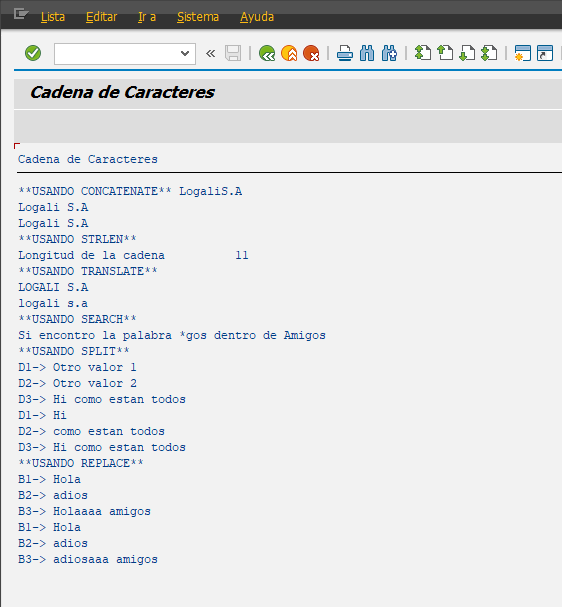

```abap
*&---------------------------------------------------------------------*
*& Report YLU_CADENA_CARACTERES
*&---------------------------------------------------------------------*
*&
*&---------------------------------------------------------------------*
REPORT ylu_cadena_caracteres.


DATA: sociedad   TYPE c LENGTH 6,
      tipo       TYPE c LENGTH 4,
      nombre_soc TYPE string,
      longitud   TYPE i.

sociedad = 'Logali'.
tipo = 'S.A'.

WRITE: / '**USANDO CONCATENATE**'.
* Ejemplo donde loes espacios no me los respeta.
CONCATENATE sociedad ' ' tipo INTO nombre_soc.
WRITE nombre_soc.

* Si queremos que me incluya espacios lo realizamos de la siguiente manera.
CONCATENATE sociedad ' ' tipo INTO nombre_soc RESPECTING BLANKS.
WRITE / nombre_soc.

* Agregando un espacio con la palabra reservada SPACE
CONCATENATE sociedad space tipo INTO nombre_soc RESPECTING BLANKS.
WRITE / nombre_soc.

* Longitud
WRITE: / '**USANDO STRLEN**'.
longitud = strlen( nombre_soc ).
WRITE: / 'Longitud de la cadena ', longitud.

WRITE: / '**USANDO TRANSLATE**'.
* Pasar a MAYOSCULAS la cadena
TRANSLATE nombre_soc TO UPPER CASE.
WRITE / nombre_soc.

* Pasar a minusculas la cadena
TRANSLATE nombre_soc TO LOWER CASE.
WRITE / nombre_soc.

WRITE: / '**USANDO SEARCH**'.
DATA: s1(20) TYPE c VALUE 'Hola',
      s2(20) TYPE c VALUE 'Amigos',
      s3     TYPE string.

* SEARCH -> Buscar una palabra dentro de una cadena.
SEARCH s2 FOR '*gos'.
*
*Si encuentra el contenido:
*
*SY-SUBRC = 0 (éxito)
*
*SY-FDPOS = posición donde empieza el valor encontrado (comienza en 0)
*
*Si no lo encuentra:
*
*SY-SUBRC = 4
*
*SY-FDPOS = 0

IF sy-subrc EQ 0.
  WRITE / 'Si encontro la palabra *gos dentro de Amigos'.
ELSE.
  WRITE / 'No encontro la palabra *gos dentro de Amigos'.
ENDIF.

* SPLIT -> Separar una cadena debido a los espacios y guardarla en variables.
WRITE: / '**USANDO SPLIT**'.
DATA: d1(20) TYPE c VALUE 'Otro valor 1',
      d2(20) TYPE c VALUE 'Otro valor 2',
      d3     TYPE string VALUE 'Hi como estan todos'.

DATA t TYPE TABLE OF string.

WRITE: / 'D1->', d1.
WRITE: / 'D2->', d2.
WRITE: / 'D3->', d3.

SPLIT d3 AT space INTO d1 d2.

WRITE: / 'D1->', d1.
WRITE: / 'D2->', d2.
WRITE: / 'D3->', d3.


* REPLACE -> Remplazando caracteres.
WRITE: / '**USANDO REPLACE**'.
DATA: b1 TYPE string VALUE 'Hola',
      b2 TYPE string VALUE 'adios',
      b3 TYPE string VALUE 'Holaaaa amigos'.

WRITE: / 'B1->', b1.
WRITE: / 'B2->', b2.
WRITE: / 'B3->', b3.

REPLACE b1 WITH b2 INTO b3.

WRITE: / 'B1->', b1.
WRITE: / 'B2->', b2.
WRITE: / 'B3->', b3.
```


