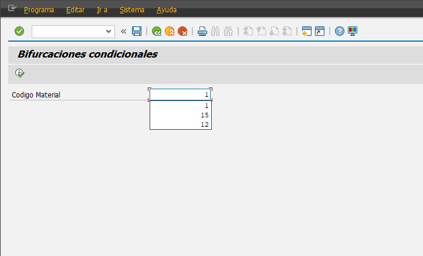
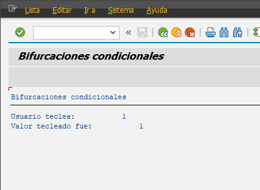

```abap
*&---------------------------------------------------------------------*
*& Report YLU_BIF_COND
*&---------------------------------------------------------------------*
*&
*&---------------------------------------------------------------------*
REPORT ylu_bif_cond.

PARAMETERS pa_cod TYPE i.

WRITE: / 'Usuario teclea: ', pa_cod.

IF pa_cod EQ 12.
  WRITE: / 'Valor bueno: ', pa_cod.
ELSE.
  WRITE: / 'Valor tecleado fue: ', pa_cod.
ENDIF.
```




