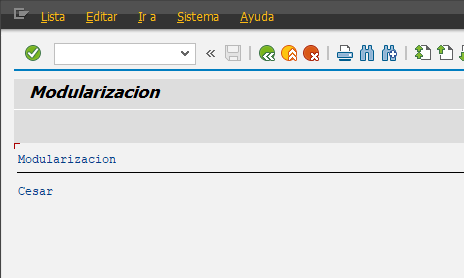

##### **Programa Inicial**

```abap
*&---------------------------------------------------------------------*
*& Report YLU_MODUL
*&---------------------------------------------------------------------*
*&
*&---------------------------------------------------------------------*
REPORT YLU_MODUL.

* TOP .- Estandar para variables globales
include YLU_INCLUDE_MODUL_TOP.

* F01 .- Numero de subrutina.
include YLU_INCLUDE_F01.

* MODUL .- Aunque aqui no se ve, son includes de control

* Los programas ejecutables en ABAP se ejecutan en base a unos eventos.
* El programa siembre se debe modularizar en includes y eventos

START-OF-SELECTION.
PERFORM establecer_nombre.

PERFORM visualizar_nombre.
```

##### TOP - Variables Globales

```abap
*&---------------------------------------------------------------------*
*& Include          YLU_INCLUDE_MODUL_TOP
*&---------------------------------------------------------------------*

DATA gv_nombre type string.
```

##### F01 - Subrutinas

```abap
*&---------------------------------------------------------------------*
*& Include YLU_INCLUDE_F01
*&---------------------------------------------------------------------*

form establecer_nombre.
  gv_nombre = 'Cesar'.
endform.

*&---------------------------------------------------------------------*
*& Form visualizar_nombre
*&---------------------------------------------------------------------*
*& text
*&---------------------------------------------------------------------*
*& -->  p1        text
*& <--  p2        text
*&---------------------------------------------------------------------*
FORM visualizar_nombre .
  write / gv_nombre.
ENDFORM.
```

##### Nota

Tambien existe otras secciones para modulariza y son los siguientes con el orden

* TOP - Variables Globales
* S01 - Parametros
* F01 - Subrutinas
* MAIN - Programa principal de ejecucion de logica
  * **START-OF-SELECTION**.

Esta modularizacion sirve con eventos y de esta forma se le permite a SAP trabajar de forma optima.


