##### Creacion de una tabla

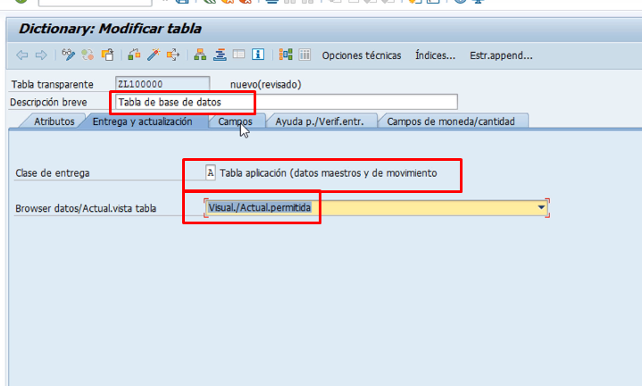

A continuacion ponemos los campos

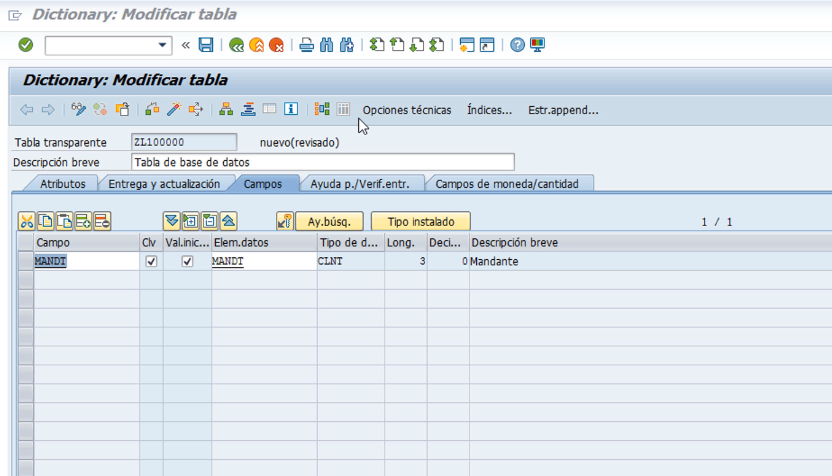

Nos vamos a Opciones Tecnicas y guardamos ya sea en Local o en un paquete

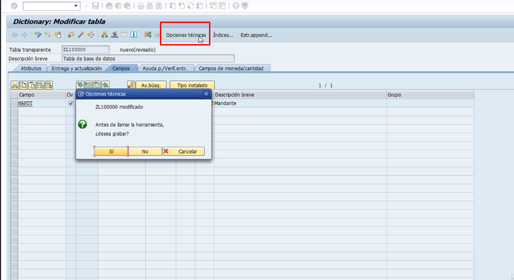

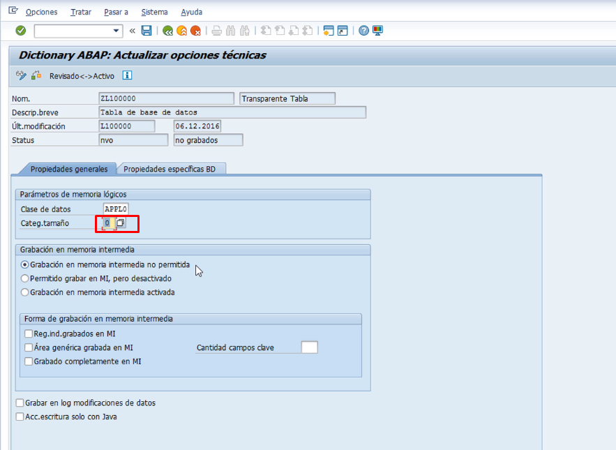

Si nosotros activamos en este momento nos saldra lo siguiente

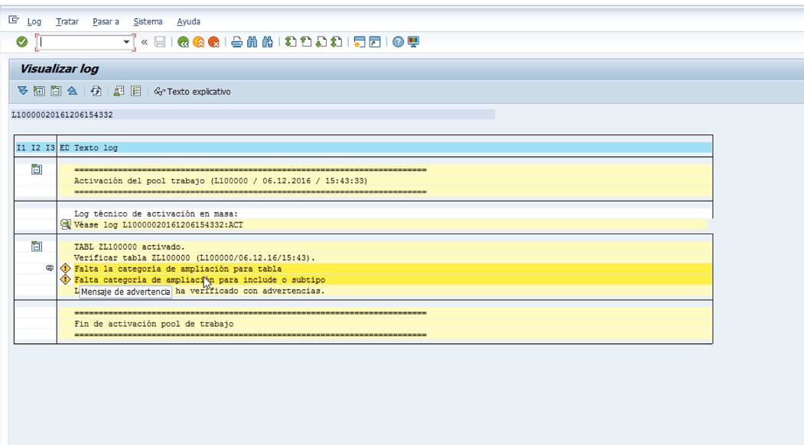

Vamos a corregir el warning y seleccionamos "Ampliable de cualquier manera"

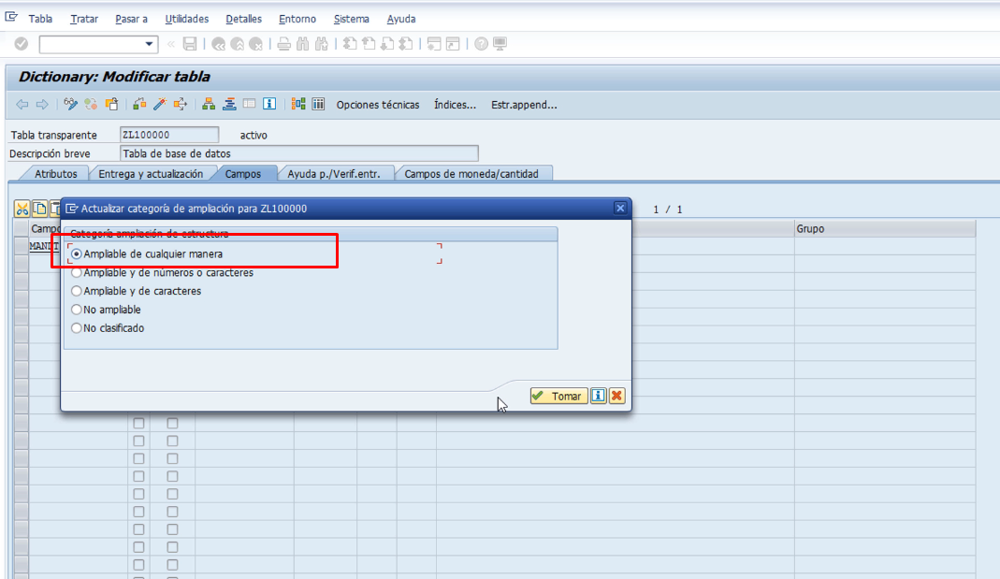

**NOTA. Siempre hay que activar nuestros objetos**

Seguimos agregando campos

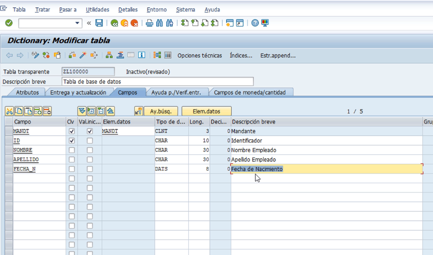

##### Visualizar la data de una forma mas moderna

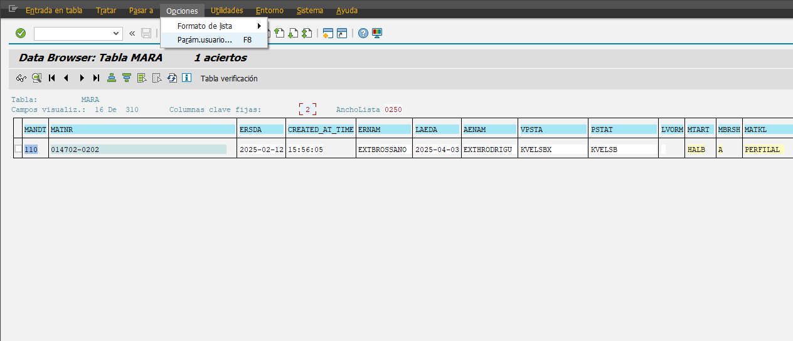

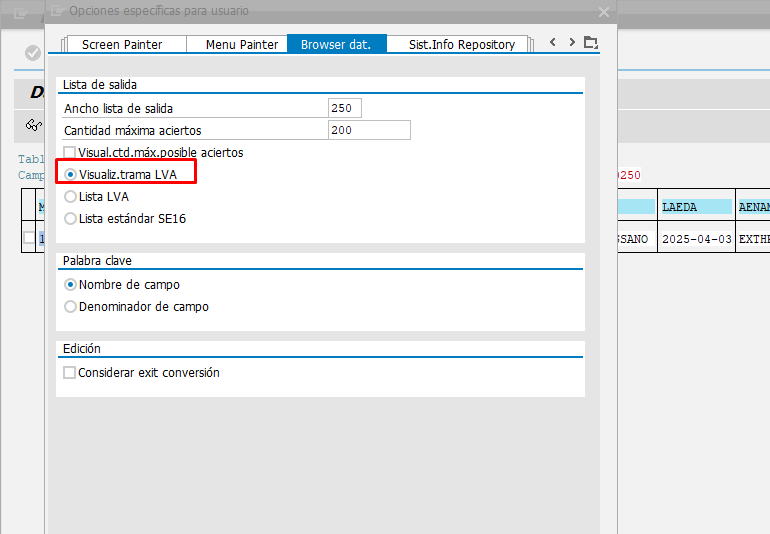

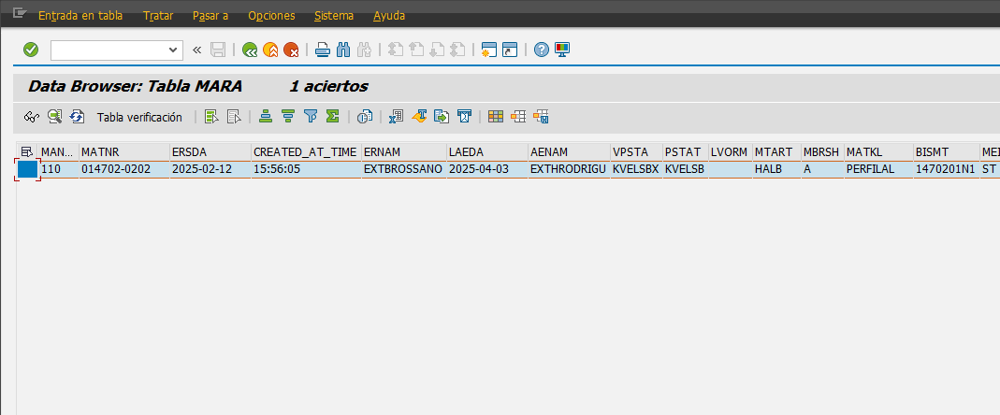

##### Para consultar la info, y saber a que se refiere el campo

Nos vamos a Opciones > Parametros de Usuario

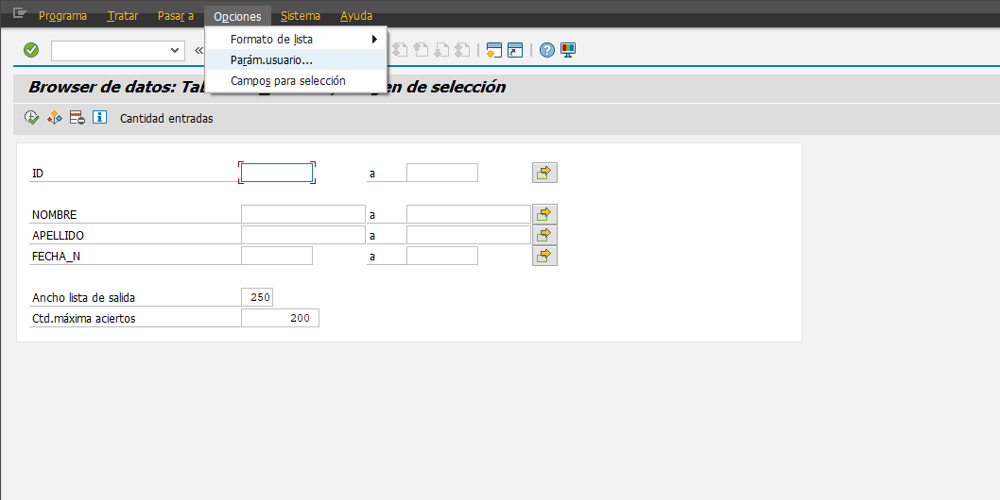

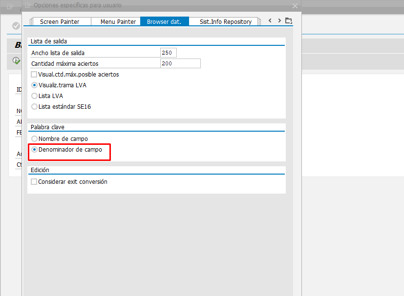

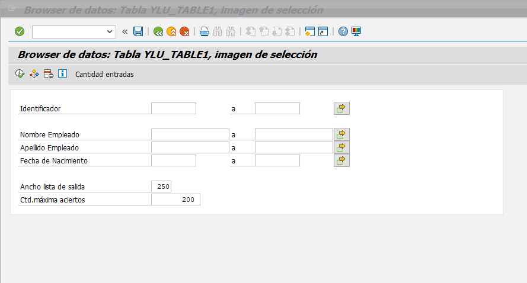

Pero en regular debemos acostumbrarnos a aprendernos los campos Tecnicos para una mejor eficiencia

Por lo que regresamos para ver los campos con el nombre tecnico
