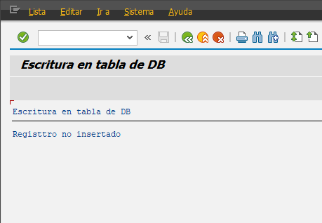

##### Programa Inicial

```abap
*&---------------------------------------------------------------------*
*& Report YLU_ESCRITURA_DB
*&---------------------------------------------------------------------*
*&
*&---------------------------------------------------------------------*
REPORT YLU_ESCRITURA_DB.

INCLUDE: YLU_ESCRITURA_TB_TOP,
         YLU_ESCRITURA_TB_F01.

START-OF-SELECTION.

  PERFORM crear_empleado.

  PERFORM insertar_empleado.
```

##### TOP

```abap
*&---------------------------------------------------------------------*
*& Include          YLU_ESCRITURA_TB_TOP
*&---------------------------------------------------------------------*

DATA gvwa_empleados type ylu_table1.
```

##### F01

```abap
*&---------------------------------------------------------------------*
*& Include          YLU_ESCRITURA_TB_F01
*&---------------------------------------------------------------------*
*&---------------------------------------------------------------------*
*& Form crear_empleado
*&---------------------------------------------------------------------*
*& text
*&---------------------------------------------------------------------*
*& -->  p1        text
*& <--  p2        text
*&---------------------------------------------------------------------*
FORM crear_empleado .
  gvwa_empleados-id = '0121456789'.
  gvwa_empleados-nombre = 'Ana'.
  gvwa_empleados-apellido = 'Lopez'.
  gvwa_empleados-fecha_n = '20001101'.


ENDFORM.
*&---------------------------------------------------------------------*
*& Form insertar_empleado
*&---------------------------------------------------------------------*
*& text
*&---------------------------------------------------------------------*
*& -->  p1        text
*& <--  p2        text
* sy-subrc se pone en zero cuando ya se agrego.
*&---------------------------------------------------------------------*
FORM insertar_empleado .


  INSERT ylu_table1 FROM gvwa_empleados.

  IF sy-subrc EQ 0.
    WRITE / 'Registtro insertado'.
  ELSE.
    WRITE / 'Registtro no insertado'.
  ENDIF.
ENDFORM.
```

En este caso no se agrego ya que ya existe el elemento en la DB


