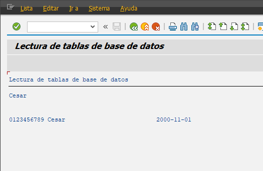

##### Programa Inicial

```abap
*&---------------------------------------------------------------------*
*& Report YLU_LECTURAS_DB
*&---------------------------------------------------------------------*
*&
*&---------------------------------------------------------------------*
REPORT YLU_LECTURAS_DB.

INCLUDE YLU_LECTURAS_DB_TOP.

INCLUDE YLU_LECTURAS_DB_F01.

START-OF-SELECTION.

PERFORM OBTENER_EMPLEADO.
```

TOP

```abap
*&---------------------------------------------------------------------*
*& Include          YLU_LECTURAS_DB_TOP
*&---------------------------------------------------------------------*

* Algo raro pasa aqui, parece que si tengo otro objeto activado donde
* tenga el mismo nombre de variable global, si en este archivo tengo
* ese nombre, no puedo activarlo, se necesita que sean diferente nombre.
DATA: gv_nombreLectura type string,
      gv_empleado type YLU_TABLE1.
```

F01

```abap
*&---------------------------------------------------------------------*
*& Include          YLU_LECTURAS_DB_F01
*&---------------------------------------------------------------------*
*&---------------------------------------------------------------------*
*& Form OBTENER_EMPLEADO
*&---------------------------------------------------------------------*
*& text
*&---------------------------------------------------------------------*
*& -->  p1        text
*& <--  p2        text
*&---------------------------------------------------------------------*
FORM obtener_empleado .
  SELECT SINGLE nombre FROM ylu_table1
         INTO gv_nombreLectura
         WHERE id = '0123456789'.

  IF sy-subrc EQ 0.
    WRITE / gv_nombreLectura.
    SKIP 2.
  ENDIF.

  SELECT SINGLE *
        FROM ylu_table1
        INTO gv_empleado
        WHERE id EQ '0123456789'.

  IF sy-subrc EQ 0.
    WRITE: / gv_empleado-id,
             gv_empleado-nombre,
             gv_empleado-fecha_n.
  ENDIF.
ENDFORM.
```


