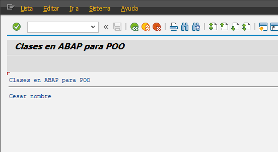

##### Programa Inicial

```abap
*&---------------------------------------------------------------------*
*& Report YLU_CLASESS_POO
*&---------------------------------------------------------------------*
*&
*&---------------------------------------------------------------------*
REPORT ylu_clasess_poo.

* =====================================================================*
CLASS cls_alumno DEFINITION.
* ---------------------------------------------------------------------*
  PUBLIC SECTION.
*   Se define el metodo y tenemos obligado a que estos methdos de que implementen..
*   [ SET ] method**
    METHODS set_nombre IMPORTING i_nombre TYPE string.

*   [ GET ] method**
    METHODS get_nombre EXPORTING e_nombre TYPE string.

* ---------------------------------------------------------------------*
  PROTECTED SECTION.

* ---------------------------------------------------------------------*
  PRIVATE SECTION.
    DATA nombre TYPE string.

ENDCLASS.

* == == == == == == == == == == == == == == == == == == == == == == == *
CLASS cls_alumno IMPLEMENTATION.

* -- -- -- -- -- -- -- -- -- -- -- -- -- -- -- -- -- -- -- -- -- -- -- *
  METHOD set_nombre.
    nombre = i_nombre.
  ENDMETHOD.

* -- -- -- -- -- -- -- -- -- -- -- -- -- -- -- -- -- -- -- -- -- -- -- *
  METHOD get_nombre.
    e_nombre = nombre.
  ENDMETHOD.
ENDCLASS.

START-OF-SELECTION.

* Apuntan a un objeto que esta instanciado en la memoria del servidor.
* go -> Global Object.
  DATA: go_cls_alumno TYPE REF TO cls_alumno,
        gv_nombre type string.

* Instanciacion de un objeto de la clase.
  CREATE OBJECT go_cls_alumno.

  call method go_cls_alumno->set_nombre
    exporting
      i_nombre = 'Cesar nombre'.

  call method go_cls_alumno->get_nombre
    importing
      e_nombre = gv_nombre.

write gv_nombre.
* go_cls_alumno->set_nombre = 'Cesar Garcia'.
```


