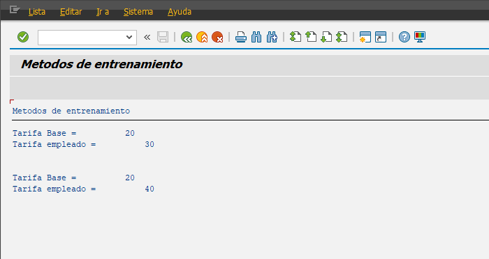

##### Metodos POO

```abap
*&---------------------------------------------------------------------*
*& Report YLU_METODOS_POO
*&---------------------------------------------------------------------*
*&
*&---------------------------------------------------------------------*
REPORT ylu_metodos_poo.

CLASS cls_tarifa DEFINITION.
  PUBLIC SECTION.

*   [STATIC METHOD.]
    CLASS-METHODS set_tar_base IMPORTING i_tarifa TYPE i.

    METHODS set_tar_empleado IMPORTING i_tarifa TYPE i.

    METHODS visualizar_tarifa.

  PRIVATE SECTION.
*   [STATIC VARIABLE]
    CLASS-DATA tar_base TYPE i.

    DATA tar_empleado TYPE i.

ENDCLASS.

CLASS cls_tarifa IMPLEMENTATION.
  METHOD set_tar_base.
    tar_base = i_tarifa.
  ENDMETHOD.

  METHOD set_tar_empleado.
    tar_empleado = i_tarifa.
  ENDMETHOD.

  METHOD visualizar_tarifa.
    WRITE: / 'Tarifa Base = ', tar_base,
           / 'Tarifa empleado = ', tar_empleado.
  ENDMETHOD.

ENDCLASS.

START-OF-SELECTION.

  DATA: go_tarifa   TYPE REF TO cls_tarifa,
        go_tarifa_2 TYPE REF TO cls_tarifa.

* LLamada valida de metodo estatico.
* cls_tarifa=>set_tar_base( i_tarifa =  10 ).

  CALL METHOD cls_tarifa=>set_tar_base
    EXPORTING
      i_tarifa = 20.

  CREATE OBJECT go_tarifa.
  CREATE OBJECT go_tarifa_2.

  go_tarifa->set_tar_empleado( i_tarifa = 30 ).

  go_tarifa_2->set_tar_empleado( i_tarifa = 40 ).

  go_tarifa->visualizar_tarifa( ).

  SKIP 2.

  go_tarifa_2->visualizar_tarifa( ).

```


