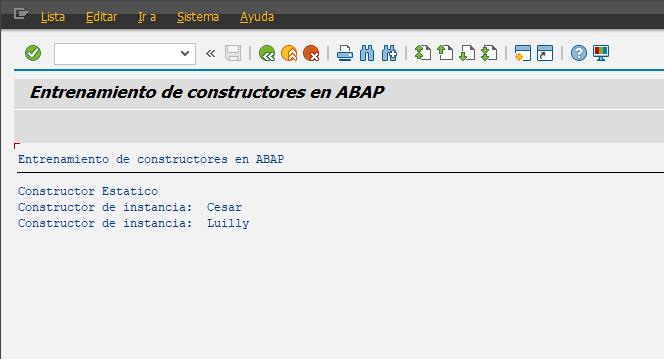

##### CONSTRUCTORES

```abap
*&---------------------------------------------------------------------*
*& Report YLU_CONSTRUCTORES_POO
*&---------------------------------------------------------------------*
*&
*&---------------------------------------------------------------------*
REPORT ylu_constructores_poo.

CLASS cls_empleado DEFINITION.

* Manera de crear un constructor.
* El constructor debe de tener el nombre 'constructor'
  PUBLIC SECTION.
* Solo existe un consultor por clase en ABAP.
    METHODS constructor IMPORTING i_nombre TYPE string.

* Constructor estatico.
    CLASS-METHODS class_constructor.
ENDCLASS.

CLASS cls_empleado IMPLEMENTATION.
  METHOD constructor.
    WRITE: / 'Constructor de instancia: ', i_nombre.
  ENDMETHOD.

  METHOD class_constructor.
    write / 'Constructor Estatico'.
  ENDMETHOD.


ENDCLASS.

START-OF-SELECTION.

  DATA: go_empleado_1 TYPE REF TO cls_empleado,
        go_empleado_2 TYPE REF TO cls_empleado.

  CREATE OBJECT go_empleado_1
    EXPORTING
      i_nombre = 'Cesar'.
  CREATE OBJECT go_empleado_2
    EXPORTING
      i_nombre = 'Luilly'.
```


